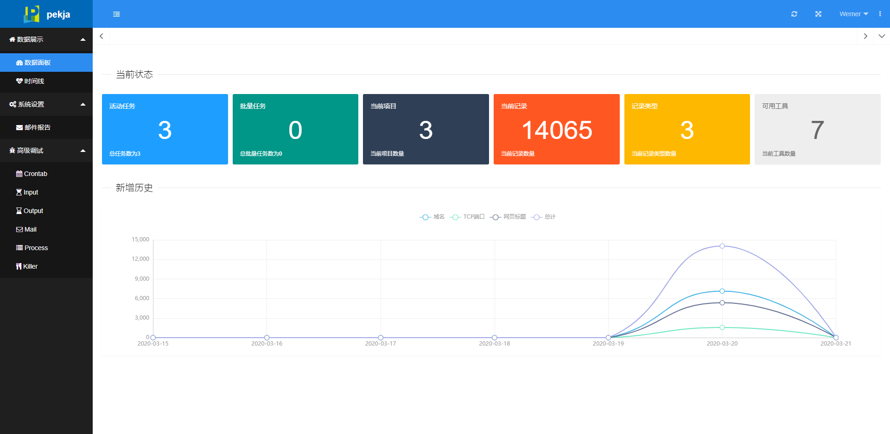

# pekja

SRC情报收集管理系统。

测试中，Bug很多，请谨慎使用。。。

## 简介

在SRC漏洞挖掘中情报至关重要，且需要进行**持续**的情报收集，以达到新资产一上线就被感知的效果。新增的资产往往最容易出现漏洞。
目前已经有了各种各样的情报收集工具，有些专注于某一种情报的收集，如只进行子域名收集，有些则可以收集多种不同的情报。
但不同工具的输出格式五花八门，缺乏一种简单的方式将不同工具的输出整理汇总，并准确找出新增资产。

为了解决这些问题设计开发了pekja。pekja可以通过Web界面调度运行各个情报收集工具，解析他们的输出，将结果以统一的格式保存到数据库中；
支持将一个工具的输出作为另一个工具的输入；支持通过邮件发送每天新增资产的报告，并提供一些用于查看数据概况和进行调试的Web页面。

### 技术栈

- 编程语言：[Python3](https://www.python.org/)
- Web框架：[Django](https://www.djangoproject.com/)
- 前端框架：[LayuiMini](http://layuimini.99php.cn/)


## 截图

### Web界面截图



### 邮件报告截图


## 支持的工具

在pekja中，一个工具只专注于收集一种情报。
若某个工具通过添加不同的参数可以收集不同的情报，则在pekja中将它视作多个工具。

不同格式的工具输出格式各不相同，支持一个工具便要有能解析该工具输出的`解析类`。
目前支持的工具如下表所示。

| 工具名| 收集的情报类型 | 解析类名 | 工具项目链接 | 版本 |
|:----:|:----:|:----:|:----:|:----:|
| Nmap SYN扫描 | TCP端口 | NmapSynScanParser | [Nmap](https://nmap.org/) | 7.7.0 |
| Nmap UDP端口扫描 | UDP端口 | NmapUdpScanParser | [Nmap](https://nmap.org/) | 7.7.0 |
| Censys邮箱采集 | 邮箱 | CensysEnumerationEmail | [censys-enumeration](https://github.com/0xbharath/censys-enumeration) | 10d42fa3 |
| Sublist3r | 域名 | Sublist3rParser | [Sublist3r](https://github.com/aboul3la/Sublist3r) | 61ebf36 |
| OneForAll子域名收集 | 域名 | OneForAllParser | [OneForAll](https://github.com/shmilylty/OneForAll) | b51236a |
| CTFR | 域名 | CTFRParser | [CTFRParser](https://github.com/UnaPibaGeek/ctfr) | 86a804a |
| lijiejie/subDomainsBrute | 域名 | LijiejieSubDomainsBrute | [subDomainsBrute](https://github.com/lijiejie/subDomainsBrute) | bac5eb3 |
| Censys子域名采集 | 域名 | CensysEnumerationDomain | [censys-enumeration](https://github.com/0xbharath/censys-enumeration) | 10d42fa3 |
| Nmap子域名爆破 | 域名 | NmapDnsBruteParser | [Nmap](https://nmap.org/) | 7.7.0 |

注：OneForAll子域名收集工具有运行完毕后无法退出[BUG](https://github.com/shmilylty/OneForAll/issues/59)，待修复。

## 名词解释

- SRC：Security Response Center，安全应急响应中心。
- 记录：一条资产或情报，如一个子域名，一个开放的端口等都可以称做一条记录。


## 安装

pekja在Python 3.8.0下进行开发和测试。

在调度工具时使用了crontab，故不支持Windows操作系统。
在Windows操作系统中可以正常运行Web服务，也可以添加任务。
但只是将需要按时执行的命令写入到`data/windows_crontab.txt`文件中，并不会真正执行。

有两种安装方法，使用Docker安装或手工安装。手工安装时除了安装pekja外还需要逐个安装支持的工具，
安装后还需要逐个核对、修改`工具表`中各个工具的`调用命令`（详情见后文），较为耗时耗力，故推荐使用Docker安装。

### 方法一：使用Docker

下载项目代码并进入项目目录：

```bash
git clone https://github.com/Werneror/pekja.git
cd pekja
```

构建Docker容器：

```bash
docker build -t pekja .
```
创建数据持久化目录：

```bash
mkdir -p /opt/pekja
```

复制配置文件：

```bash
cp docker/env.example docker/env
```

编辑配置文件`env`，按实际情况修改其中的配置：

```bash
vim docker/env
```

建议至少修改初始化用户的密码。
若想要使用邮件报告功能，还需修改初始化用户的邮箱地址为真实有效的邮箱地址。
因为邮件报告会发到每个用户的邮箱中。
当然也需要修改用于发送邮件报告的邮箱的相关配置。

运行容器：

```bash
docker run -d -p 8000:8000 --env-file docker/env -v /opt/pekja:/opt/pekja/data --restart=always --name pekja pekja:latest
```

如果需要更新，可运行自动更新脚本：

```bash
./docker/update.sh
```

第一次运行该脚本前可能需要赋予该脚本可执行权限：

```bash
chmod +x docker/update.sh
```

若某次更新改动过大直接使用自动更新脚本可能会失败。
这时需要先通过Web界面管理后台的批量导出功能备份数据，然后删除数据目录/opt/pekja中的所有文件，最后再运行更新脚本。
重新导入数据时需按照`工具`->`项目`->`任务`->`批量任务`->`记录`的顺序进行。

### 方法二：手动安装

#### 安装pekja

下载项目代码并进入项目目录：

```bash
git clone https://github.com/Werneror/pekja.git
cd pekja
```

安装依赖库：

```bash
python -m pip install -r requirements.txt
```

默认使用Sqlite3作为数据库，故可直接创建数据表：

```bash
python manage.py migrate
```

也可以修改`pekja/settings.py`中的`DATABASES`等相关配置以使用其他数据库。

导入工具数据：

```bash
python manage.py loaddata docker/tool.json
```

创建用户：

```bash
python manage.py createsuperuser
```

若想要使用邮件报告功能，在创建用户时需录入真实有效的邮箱地址。
邮件报告会发到每个用户的邮箱中。
还需按实际情况修改`pekja/settings.py`中的发送邮件相关的配置：

```Python
EMAIL_HOST = 'smtp.163.com'    # SMTP 服务器地址
EMAIL_PORT = 994    # SMTP 服务端口
EMAIL_USE_SSL = True    # 是否使用 SSl
EMAIL_HOST_USER = 'pekja@werner.wiki'    # 发件邮箱（用户名）
EMAIL_HOST_PASSWORD = '**************'    # 密码
```

运行Web服务：

```bash
python manage.py runserver 127.0.0.1:8000
```

若安装成功，在浏览器中访问[http://127.0.0.1:8000]()可以看到登录页面，用刚刚创建的用户可以登录进入Web界面。
点击Web界面右上角的用户名，在弹出菜单中点击`管理后台`按钮，可进入到管理后台。

#### 安装工具

在管理后台的`首页`→`Pekja`→`工具`中可以看到目前支持的所用工具。若想使用其中的某个工具，需要打开对应工具的`项目链接`，
自行安装该工具，最好能安装`工具`中指定的版本。安装完成后，还需根据工具实际路径修改`调用命令`，确保在crontab中可以成功调用。

`工具`中各个字段的含义和作用说明如下：

- 工具名：工具的名字
- 项目地址：该工具的项目地址
- 记录类型：该工具收集何种类型的情报
- 输出解析类：解析该工具输出结果的解析类
- 调用命令：调用该工具的命令，必须包含`{input}`和`{output_file}`两个占位符
- 输入参数类型：
    - 若输入参数类型为`文件`，则`{input}`会被替换成文件路径
    - 若输入参数类型为`参数`，则`{input}`会被替换为参数本身（后文中有进一步的解释）
- 版本：推荐的工具版本
- 备注：备注信息


## 使用

### 添加项目

`项目`用于组织`任务`和`记录`，每个`任务`和`记录`都属于且仅属于一个`项目`。

在管理后台的`首页`→`Pekja`→`项目`中可以查看和添加`项目`，各个字段的含义和作用说明如下：

- 项目名：项目的名字，可以是一家公司的名字
- SRC链接：该项目对应的SRC的链接
- 备注：一些备注信息

### 添加任务

一个任务是按特定调度以一定输入调用特定工具。

在管理后台的`首页`→`Pekja`→`任务`中可以查看和添加`任务`，各个字段的含义和作用说明如下：

- 任务名：任务名称
- 所属项目：该任务属于哪个项目
- 工具：该任务调用的是哪个工具
- 输入：该任务的输入是什么
- 输入文件类型：仅`工具`的`输入参数类型`为`文件`时有效
- 调度：crontab格式的字符串，以说明该任务应该在何时被执行
- 是否生效：可以选择否以替代删除

每新增一条`任务`，pekja都会在crontab中新增一条对应的定时任务，
定时任务的内容是替换了占位符的对应`工具`的`调用命令`和输入、输出处理命令。
每次保存`任务`时都会更新crontab定时任务。每次更新`工具`（表）中`工具`时也会自动更新所有使用该工具的`任务`在crontab中对应的定时任务。
但需**特别注意**通过`导入`批量导入时不会更新crontab定时任务。

`工具`的`输入参数类型`为`参数`时，会直接用`任务`的`输入`替换`工具`的`调用命令`中的`{input}`。

`工具`的`输入参数类型`为`文件`时：

- 若`任务`的`输入文件类型`为`静态`，则将`任务`的`输入`写入到输入文件中
- 若`任务`的`输入文件类型`为`动态`，则在每次任务实际运行时查询`记录表`中属于该`项目`的所有类型为`任务`的`输入`的记录，将记录内容写入到输入文件中

用输入文件的路径替换`工具`的`调用命令`中的`{input}`。

用输出文件的路径替换`工具`的`调用命令`中的`{output_file}`。
要求工具将有效输出写入到该文件中，pekja会从该文件中解析有效内容。
还要求工具返回有意义的返回码。

占位符可以出现多次，将都被替换。

输入文件的文件名是`input-{任务ID}.txt`，输出文件的文件名是`output-{任务ID}.txt`。
输出文件解析完毕后就会被重命名为`output-{任务ID}-{yyyy-MM-d-HH-mm-ss}.txt`，不会被自动删除。

所有输出文件和输入文件的路径由`pekja/settings.py`中的`DATA_DIRS`定义，默认值是项目目录中`data`文件夹。

### 添加批量任务

有时我们希望多个任务能依次执行，但由于我们不知道每个任务执行完毕需要花费多少时间，通过精心设置`任务表`中的`调度`也难以实现。
故提供`批量任务`功能以实现此需求。

在管理后台的`首页`→`Pekja`→`批量任务`中可以查看和添加`批量任务`，各个字段的含义和作用说明如下：

- 批量任务名: 批量任务名
- 任务1~10: 需要依次执行的任务，最多可添加10个
- 调度：crontab格式的字符串，以说明该批量任务应该在何时被执行
- 是否生效：可以选择否以替代删除

`批量任务`中的每个`任务`都是`任务`（表）中的一个`任务`。需先在`任务`（表）中添加`任务`，才能在`批量任务`中选择它。
若某个`任务`只在`批量任务`中运行，可以在`任务表`中将它的`是否生效`设置为否。

每新增一个`批量任务`，pekja都会在crontab中新增一条对应的定时任务，
每次保存`批量任务`时都会更新crontab定时任务。每次更新`任务`（表）中的`任务`或`工具`（表）中`工具`时也会自动更新对应的`批量任务`在crontab中对应的定时任务。
同样地，需要注意通过`导入`批量导入时不会更新crontab定时任务。

### Web界面

在登录状态下访问[http://127.0.0.1:8000/]()可打开Web界面。
Web界面分为前端页面和管理后台两部分。前面介绍了管理后台相关操作，这里介绍各个前端页面。

- 数据展示
    - 数据面板：显示当前数据概览和过去一周里每日各种类型的记录新增数量曲线图。
    - 时间线：显示每日新增记录，可按项目或记录类型进行全匹配过滤。
- 系统设置
    - 邮件报告：显示邮件报告的收件邮箱地址和发送定时任务，并可设置发送定时任务。
- 高级调试
    - Crontab：显示Crontab中所有定时任务。
    - Input：显示所有任务的输入文件，可查看内容，并可按任务ID过滤。
    - Output：显示所有任务的输出文件，可查看内容，并可按任务ID过滤。
    - Mail：显示/var/mail/mail文件的内容。当定时任务执行出错时错误信息会写在该文件中。
    - Process：显示系统中当前所有的进程。
    - Killer：按进程号结束某个进程。

### 邮件报告

若想要定时收到邮件报告，请在Web界面前端页面的`系统设置`-`邮件报告`中设置Crontab定时任务。


### 备份数据

只备份工具表数据：

```bash
python manage.py dumpdata entities.tool --format=json > docker/tool.json
```

备份数据库中所有数据：

```bash
python manage.py dumpdata --format=json > backup.json
```

导入备份的数据：

```bash
python manage.py loaddata docker/tool.json
```

也可以在Web界面管理后台通过批量导出备份数据。


## 高级

这部分的操作将编写代码，需要读者掌握Python 3编程语言。

### 新增对某工具的支持

下面将以工具`Censys子域名采集`为例演示如何新增对某工具的支持。

#### 安装和试运行

工具`Censys子域名采集`使用的是[censys-enumeration](https://github.com/0xbharath/censys-enumeration/)，下载安装并尝试运行，
弄清楚命令参数和输出文件格式，并获得输出文件样本。

#### 创建输出解析类

输出解析类必须是`parse.parser.Parser`的子类，该类的`file_path`是待解析文件（工具输出结果）的路径， 
必须实现方法`parse`，在`parse`中需解析工具输出结果，并调用该类的`add_record`方法将解析出的结果保存到数据库中。
`add_record`会处理记录重复问题，故在解析工具输出结果时不用特别处理重复的记录。

`Censys子域名采集`的输出文件示例如下：

```json
{"testfire.net": {"domain": "testfire.net", "subdomains": ["demo.testfire.net", "ftp.testfire.net"]}}
```

下面将编写用于解析上述输出的解析类。在`parse`目录中创建文件`censys_enumeration_domain.py`，内容为：

```python
from .parser import Parser    # 导入解析类父类
import json    # 这个工具的输出是json格式的，故导入json库


class CensysEnumerationDomain(Parser):    # 类名会出现在工具表输出解析类下拉选项中
    """python censys_enumeration.py --no-emails --outfile {output_file} {input}
       for censys_enumeration.py 10d42fa3"""    # 建议写明工具调用命令和编写解析类时的工具版本

    def parse(self):
        with open(self.file_path) as f:
            output = json.loads(f.read())    # 从待解析文件中读入数据
        for domain in output:
            sub_domains = domain.get('subdomains', list())
            for sub_domain in sub_domains:
                self.add_record(sub_domain)    # 将解析出的记录加入到数据库中
```

然后编辑`parse/__init__.py`，在末尾新增一行，引入刚刚编写的结果解析类：

```python
from .censys_enumeration_domain import CensysEnumerationDomain
```

#### 在工具表中添加工具

进入到Web管理后台，在`工具表`中新增一个工具，各个字段填写的内容如下：

- 工具名: Censys子域名采集
- 项目地址: https://github.com/0xbharath/censys-enumeration/
- 记录类型: 域名
- 输出解析类: CensysEnumerationDomain
- 调用命令: python censys_enumeration.py --no-emails --outfile {output_file} {input}（需特别注意命令路径）
- 输入参数类型: 文件
- 版本：10d42fa3（没有明确版本号的可以写commit ID）
- 备注：留空

添加完成后便可在任务中使用此工具。

### 自定义Django命令

此处给出所有自定义Django命令及其参数和说明。

| 命令 | 参数 | 说明 |
|:----:|:----:|:-----:|
| init_admin | 用户名，邮箱，密码 | 创建初始化用户，仅在没有用户时有效 |
| cron_all_task | 无 | 把任务表中所有任务添加到crontab中 |
| parse | 任务ID | 解析指定ID任务的输出文件，将结果保存到数据库中 |
| update_input | 任务ID | 更新指定ID任务的输入文件，只对输入文件类型为动态的任务有效 |
| set_record_report_cron | 文件路径 | 将文件路径所指文件的内容设置为发送邮件报告的时间 |
| record_report | 日期（可选） | 通过邮件发送今日或某日（若有日期参数）的新增记录报告 |

自定义Django命令的用法如下：

```shell script
python manage.py <命令> <参数1> <参数2> <...>
```

如：

```shell script
python manage.py init_admin admin admin@example.com 123456 
```

## 常见问题

### 项目为何叫这个名字？

没有特别含义，是用[UNIQ名生成器](https://uniq.site/zh/)随机生成的。

### 有没有类似项目？

有。后文列出了笔者已知的类似项目。

### 为何要重复造轮子？

我想写的实际上是一个可以调用任意信息收集工具的通过框架，和所有我已知的项目都有所不同。


## 下一步计划

- 添加对更多工具的支持


## 类似项目

- [get_domain: 域名收集与监测](https://github.com/guimaizi/get_domain)
- [LangSrcCurise: SRC子域名资产监控](https://github.com/LangziFun/LangSrcCurise)
- [spiderfoot: an open source intelligence automation tool](https://github.com/smicallef/spiderfoot)
